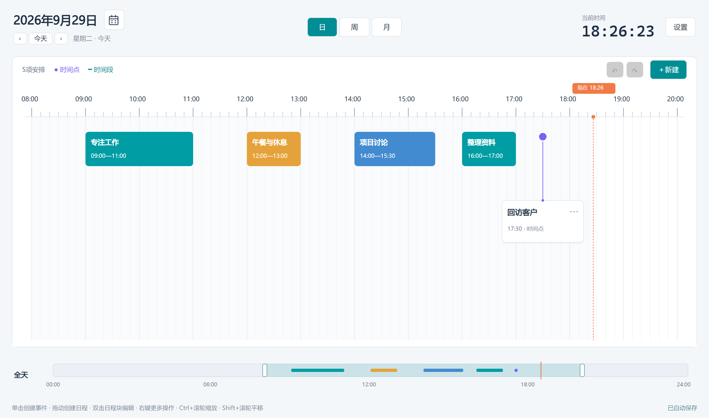
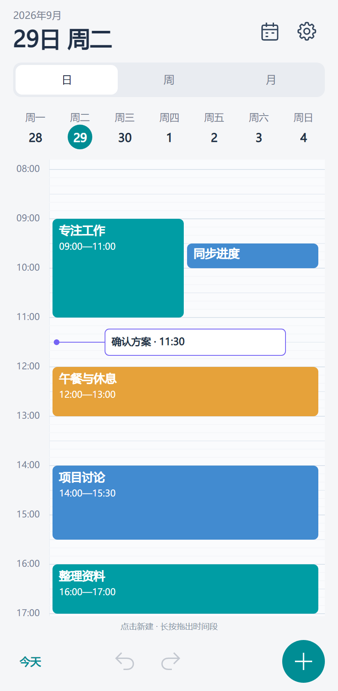
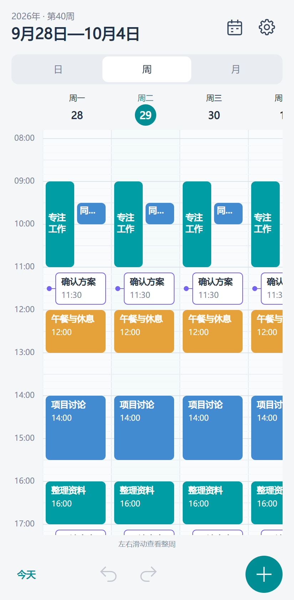

# 时间规划局

基于C#与Avalonia的跨平台日程规划应用，提供日、周、月视图。

## 界面与功能



| 手机日视图 | 手机周视图 |
| --- | --- |
|  |  |

- **桌面端**：横向时间轴，点击创建事件、拖动创建时间段，支持调整时长、网格吸附和缩放。
- **手机端**：日视图采用纵向时间轴，周视图每天一列、左右滑动查看；点击空白新建事件，长按拖出时间段，点击色块编辑。月历可查看每天的安排。
- **共用数据逻辑**：所有日期自动保存，支持自定义颜色、提前提醒、撤销和重做。
- **偏好设置**：默认显示时段、5分钟或10分钟吸附；桌面端可关闭到托盘。

当前开发目标为Windows和Android。Linux、macOS共用桌面入口，iOS已建立项目入口，待对应系统验证。

## 工程

```text
src/
  DayPlanner.Core/       日程模型、时间计算、存储、撤销重做
  DayPlanner.UI/         Avalonia桌面和手机界面
  DayPlanner.Desktop/    Windows、Linux、macOS入口
  DayPlanner.Android/    Android入口与系统提醒
  DayPlanner.iOS/        iOS入口
tests/DayPlanner.Tests/ 数据与界面检查
```

## 构建与运行

需要.NET 10 SDK。Android另需.NET Android工作负载、Android SDK和JDK，可使用Android Studio附带的工具。

```powershell
# 桌面端开发
dotnet run --project src/DayPlanner.Desktop

# 在桌面预览手机布局
dotnet run --project src/DayPlanner.Desktop -- --mobile-preview

# Windows单文件程序，包含运行时
powershell -ExecutionPolicy Bypass -File tools/build.ps1 -Target Windows

# Android开发版APK
dotnet workload install android
powershell -ExecutionPolicy Bypass -File tools/build.ps1 -Target Android
```

Windows程序位于`release/windows/DayPlanner.exe`，Android开发包位于`release/android/DayPlanner-android-dev.apk`。Android最低版本为8.0；正式分发时需配置自己的签名密钥。

运行Android Studio模拟器后可安装：

```powershell
adb install -r release/android/DayPlanner-android-dev.apk
```

Windows提醒需要程序保持运行，可在设置中启用关闭到托盘。Android提醒需允许通知权限。精确时间提醒还需系统“闹钟和提醒”授权，未授权时可能延迟。设备重启后会重新安排提醒；系统强行停止应用后需重新打开。

## 数据与历史版本

Windows沿用`%LOCALAPPDATA%\DayPlanner\schedule.json`，兼容WPF版数据。手机端保存在应用私有目录，卸载应用会清除本地数据。各设备独立保存。

上一次保存的备份为`schedule.json.bak`，旧格式迁移另保留`.v1.bak`。

[WPF历史版本v1.1.0](https://github.com/Howlclat/DayPlanner/releases/tag/v1.1.0)仍可下载，源码保存在对应Git标签。

## 检查

```powershell
dotnet run --project tests/DayPlanner.Tests
```

检查使用独立数据，结果与桌面、手机布局截图输出到`artifacts/avalonia-validation`。
