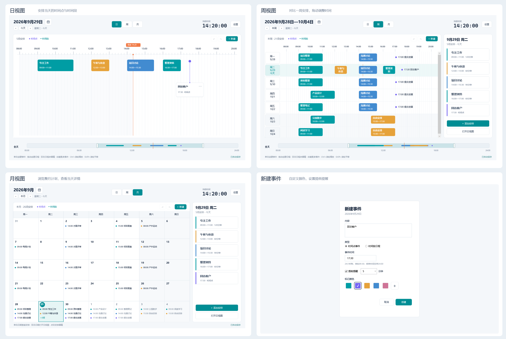

# 时间规划局

支持日、周、月视图的Windows日程规划应用。

## 功能



- **日、周、月视图**：按天安排时间、按周对比日程、按月浏览计划，三种视图共用数据。
- **时间点与时间段**：点击或拖动创建，支持移动、调整时长和自定义颜色。
- **当天详情**：周、月视图右侧显示所选日期的完整安排，可直接编辑。
- **提前提醒**：默认提前5分钟，可自行调整；最小化到托盘后继续提醒。
- **本地保存**：保存所有日期的安排，支持撤销、重做和数据备份。
- **偏好设置**：设置默认显示时段、5分钟或10分钟吸附，以及关闭时最小化到托盘。

## 下载与运行

从[GitHub Releases](https://github.com/Howlclat/DayPlanner/releases)下载最新ZIP，解压后运行`DayPlanner.exe`，适用于Windows11（x64）。

## 操作

- **日、周视图**：单击时间轴空白处创建时间点，拖动创建时间段；拖动日程移动，拖动两端调整时长。
- **编辑安排**：双击时间轴上的安排，或点击右侧详情；右键可编辑、删除。
- **月视图**：单击日期查看安排，点击安排编辑，双击日期进入日视图；“新建”添加到所选日期。
- **切换日期**：顶部箭头切换前后一天、一周或一月，日历按钮选择日期。
- **调整范围**：拖动底部滑条平移视区，拖动两端改变显示范围。

## 快捷键

|快捷键|操作|
|---|---|
|Ctrl+N|新建|
|Ctrl+Z / Ctrl+Y|撤销 / 重做|
|Ctrl+S|重试保存|
|Ctrl+滚轮|缩放时间轴|
|Shift+滚轮 / 鼠标中键拖动|平移时间轴|
|Enter / Delete|编辑 / 删除时间轴中所选安排|
|Esc|取消拖动或关闭编辑窗口|
|Ctrl+Enter|保存编辑|

## 数据

全部日期的安排自动保存至`%LOCALAPPDATA%\DayPlanner\schedule.json`，上一次保存的备份为同目录下的`schedule.json.bak`。

迁移到其他电脑时，退出程序后复制该数据文件到相同位置。

## 构建

需要Windows、.NET 10 SDK及.NET Framework 4.8 Developer Pack。

```powershell
dotnet run
dotnet publish -c Release -p:DebugType=None -p:DebugSymbols=false -o release
```
