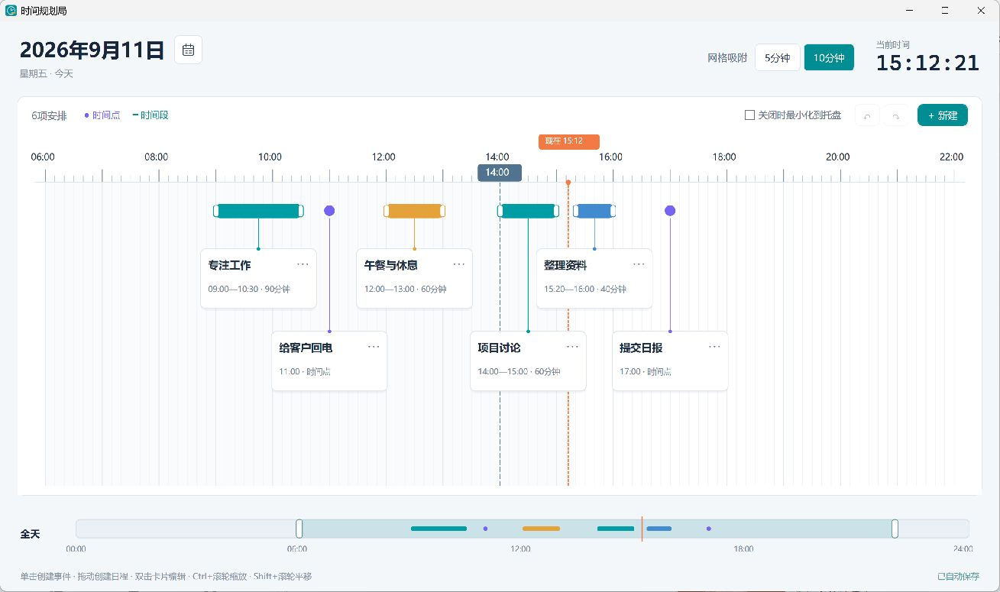

# 时间规划局

通过横向时间轴规划每日安排的Windows桌面应用。

## 功能




- **时间点与时间段**：点击记录事件，拖动创建日程。
- **时间轴交互**：拖动调整时间，支持网格吸附、缩放和平移。
- **多日期管理**：按日期查看安排，自动保存到本地。
- **自定义颜色**：用不同颜色区分安排。
- **提前提醒**：设置提醒时间，支持托盘后台运行。

## 下载与运行

从[GitHub Releases](https://github.com/Howlclat/DayPlanner/releases)下载最新ZIP，解压后运行`DayPlanner.exe`，适用于Windows11（x64）。

## 快捷键

|快捷键|操作|
|---|---|
|Ctrl+N|新建|
|Ctrl+Z / Ctrl+Y|撤销 / 重做|
|Ctrl+S|重试保存|
|Enter|编辑所选安排|
|Delete|删除所选安排|
|Esc|取消拖动或关闭编辑窗口|
|Ctrl+Enter|保存编辑|

## 数据

全部日期的安排自动保存至`%LOCALAPPDATA%\DayPlanner\schedule.json`，上一次保存的备份为同目录下的`schedule.json.bak`。

## 构建

需要Windows、.NET 10 SDK及.NET Framework 4.8 Developer Pack。

```powershell
dotnet run
dotnet publish -c Release -p:DebugType=None -p:DebugSymbols=false -o release
```
